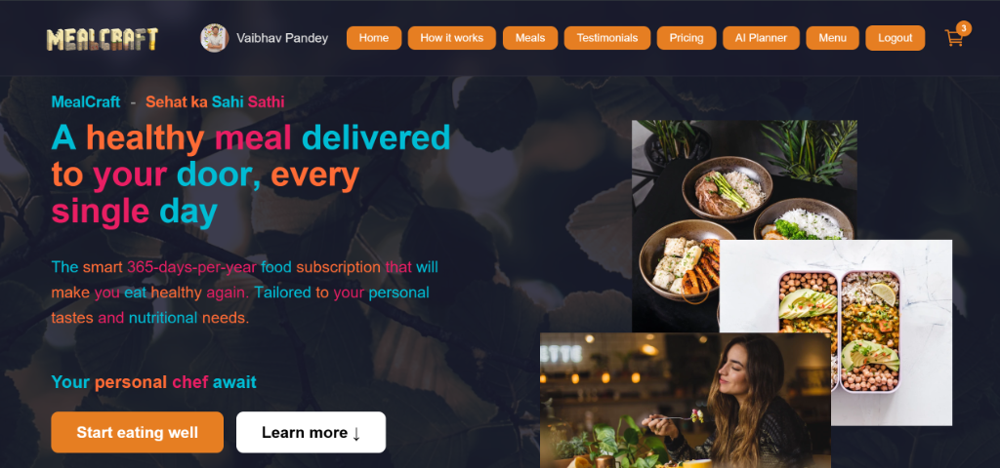

# 🍽️ MealCraft - Premium AI Meal Planner & Subscription Web App

MealCraft is a premium food subscription service and AI-powered meal planner designed to make clean eating effortless and delicious. The application automatically calculates caloric targets based on user metrics and generates customized weekly meal plans that work with any diet.



---

## 🚀 Key Features

* **🤖 AI Meal Planner**: Calculates daily BMR and TDEE targets based on physical metrics (age, weight, height, gender, activity level) and fitness goals (weight loss, maintenance, muscle gain).
* **📅 Interactive Weekly Dashboard**: Renders breakfast, lunch, and dinner cards for each day of the week, with options to dynamically **Swap** individual slots or **Re-Generate** the entire plan.
* **🥗 Custom Diet Categories**: Fully supports 9 distinct dietary preferences including:
  * Pure Vegetarian 🟢
  * Non-Vegetarian 🔴
  * Healthy / Vegan 🌱
  * **Jain Friendly (No Onion-Garlic)** 🔸
  * **Festival Special (Satvik / Fasting)** 🌾
* **💳 Secure Payments**: Integrated **Stripe Checkout** modal with card tokenization and private Payment Intent generation.
* **📦 Complete Cart & Checkout Flow**: Add weekly plans to the cart, specify delivery addresses, and save processed orders to the database.

---

## 📁 Project Structure

The project is structured as a monorepo containing two main modules:

```text
MealCraft/
├── Backend/                 # Express.js REST API server
│   ├── models/              # Mongoose DB schemas (User, Meal, Order)
│   ├── routes/              # Auth, Meal, Order, and Stripe Payment endpoints
│   ├── seed_meals.js        # Seed database script
│   └── app.js               # Main server entrypoint
│
└── frontend/                # React.js SPA (Vite builder)
    ├── public/              # Public assets and step mockups
    └── src/
        ├── components/      # Common UI (Navbar, Footer, Hero, PaymentModal)
        ├── pages/           # Pages (Home, Menu, AIPlanner, PlannerResult, Orders)
        └── context/         # Auth and Cart state contexts
```

---

## ⚙️ Prerequisites

* [Node.js](https://nodejs.org/) (v18 or higher recommended)
* [MongoDB Atlas](https://www.mongodb.com/cloud/atlas) (or local MongoDB database instance)
* [Stripe Developer Account](https://stripe.com/) (for payment API keys)

---

## 🛠️ Getting Started

### 1. Setup Backend Server

1. Navigate to the backend folder:
   ```bash
   cd Backend
   ```
2. Install dependencies:
   ```bash
   npm install
   ```
3. Create a `.env` file in the `Backend` directory using the variables below:
   ```env
   PORT=5000
   MONGO_URI=your_mongodb_connection_string
   JWT_SECRET=your_jwt_auth_secret_key
   STRIPE_SECRET_KEY=your_stripe_secret_api_key
   ```
4. Run the database seed script to populate default meals (including Jain and Fasting specials):
   ```bash
   node seed_meals.js
   ```
5. Start the backend development server:
   ```bash
   npm run dev
   ```

### 2. Setup Frontend Application

1. Navigate to the frontend folder:
   ```bash
   cd frontend
   ```
2. Install dependencies:
   ```bash
   npm install
   ```
3. Create a `.env` file in the `frontend` directory:
   ```env
   VITE_STRIPE_PUBLISHABLE_KEY=your_stripe_publishable_key
   ```
4. Start the frontend Vite server:
   ```bash
   npm run dev
   ```

---

## 📹 Large Media Files (BG.mp4)

The high-definition background video `BG.mp4` (used as the dynamic hero background) is cached locally in the root directory and in `frontend/public/img/bg.mp4` for local runtime rendering.
To avoid bloating the GitHub repository size and ensure fast uploads/cloning, **`BG.mp4` is ignored in git** via the root `.gitignore` file.

If you clone this repository to another system, simply place your high-definition background video inside the `frontend/public/img/` folder with the name `bg.mp4` to enable hero video backgrounds.

---

## 🔗 Deployment Details

* **Repository link**: [https://github.com/Vaibhavpandey8/MealCraft](https://github.com/Vaibhavpandey8/MealCraft)
* **Frontend Build Directory**: `frontend/dist`
* **Vercel/Netlify root directory**: `frontend`
* **Render/Railway backend server port**: `5000` (runs `npm start` from `Backend`)
